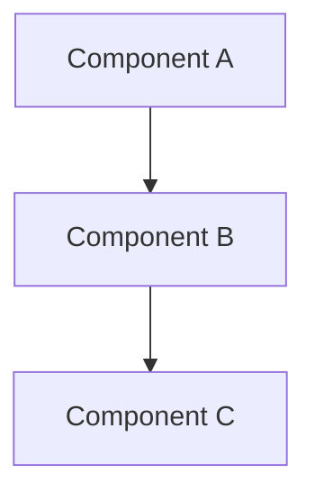

# Architecture

## System Overview
<!-- High-level description of the system: what it does, how it's structured, key boundaries. -->

## Tech Stack

| Layer | Technology | Rationale |
|-------|------------|-----------|
| Frontend | | |
| Backend | | |
| Database | | |
| Infrastructure | | |
| Auth | | |

## Component Diagram

## Data Models
<!-- Key entities, their fields, and relationships. Use tables or code blocks. -->

### Entity: [Name]
| Field | Type | Description |
|-------|------|-------------|
| id | | |
| | | |

## API Design
<!-- High-level API surface. Detailed endpoint docs go in docs/api.md during Phase 5. -->

## Architecture Decision Records

### ADR-001: [Decision Title]
- **Decision**:
- **Context**:
- **Options Considered**:
- **Rationale**:
- **Consequences**:

<!-- Append additional ADRs here as decisions are made during architecture and execution phases. -->
