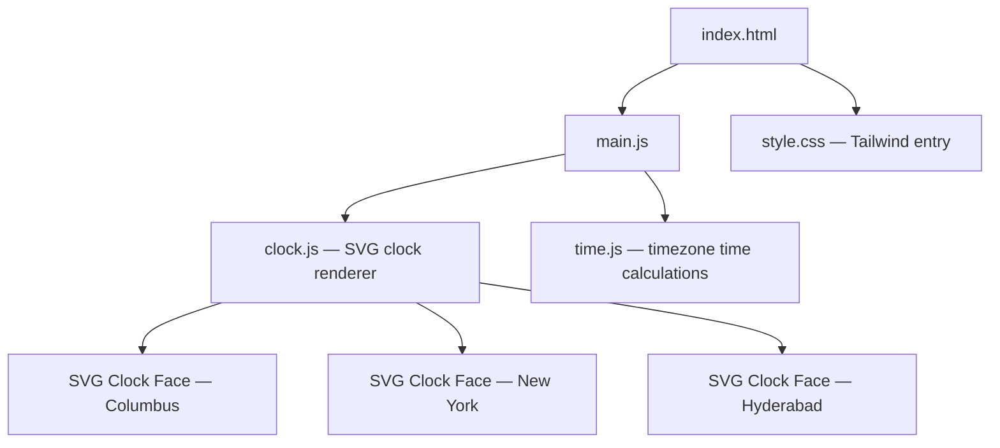

# Architecture

## System Overview
A static single-page web application that renders three analog SVG clocks showing live time for Columbus (OH), New York (NY), and Hyderabad (India). Built with vanilla JavaScript, styled with Tailwind CSS, and deployed as a static site on Vercel. No backend, no API, no server-side logic.

This project has a UI layer. UI testing subagent will be activated in Phase 5 for units that touch UI files.

## Tech Stack

| Layer | Technology | Rationale |
|-------|------------|-----------|
| Frontend | Vanilla JS + Vite (build tool) | Zero runtime overhead; Vite provides dev server + HMR + Tailwind processing without shipping a framework |
| Rendering | SVG (inline) | Scalable on all screen sizes, simple DOM manipulation for clock hands, no canvas context needed |
| Styling | Tailwind CSS | Utility-first, purged in production for minimal CSS bundle |
| Infrastructure | Vercel (static deploy) | Free tier, instant deploys, CDN-backed |
| Auth | None | Personal use, no auth needed |

## Component Diagram

## Data Models

### City Clock Configuration
| Field | Type | Description |
|-------|------|-------------|
| name | string | Display name (e.g., "Columbus") |
| timezone | string | IANA timezone identifier (e.g., "America/New_York") |
| abbreviation | string | Timezone abbreviation for display (e.g., "EST") |

No database. City configs are hardcoded as a JS array.

## API Design
None — fully client-side application.

## Architecture Decision Records

### ADR-001: Vanilla JS over Next.js / React
- **Decision**: Use vanilla JavaScript with Vite as a build tool instead of Next.js or React
- **Context**: Need a fast-loading, mobile-friendly clock display app deployed to Vercel
- **Options Considered**: Next.js, Vite + React, Vanilla JS + Vite
- **Rationale**: The app has no routing, no API calls, no state management needs. Next.js (~80-90 KB) and React (~40-45 KB) add runtime overhead with zero benefit for this use case. Vanilla JS can achieve ~5 KB total bundle. Vite provides excellent DX (hot reload, Tailwind processing) without shipping any runtime code.
- **Consequences**: No component abstraction — acceptable for 3 clocks. If the app grows significantly (v2 city selection), may revisit. Vite still enables Vercel static deploys seamlessly.

### ADR-002: SVG over Canvas for Clock Rendering
- **Decision**: Use inline SVG elements for analog clock faces
- **Context**: Need to render analog clocks that look crisp on all screen sizes including mobile
- **Options Considered**: SVG, HTML5 Canvas
- **Rationale**: SVG scales perfectly with CSS (vector-based), is accessible to screen readers, and integrates naturally with DOM manipulation. Canvas would require manual DPI scaling and offers no benefit for simple clock geometry. SVG clock hands can be rotated via CSS transforms or SVG transform attributes.
- **Consequences**: Slightly more DOM nodes than Canvas, but negligible for 3 clocks.

### ADR-003: Tailwind CSS for Styling
- **Decision**: Use Tailwind CSS with Vite's PostCSS integration
- **Context**: Need responsive, mobile-friendly layout with minimal custom CSS
- **Options Considered**: Plain CSS, Tailwind CSS, CSS Modules
- **Rationale**: Tailwind provides responsive utilities out of the box, purges unused styles in production (tiny CSS output), and speeds up layout work. For a small app, the purged output is comparable to hand-written CSS.
- **Consequences**: Adds Tailwind + PostCSS as dev dependencies. Production CSS bundle remains small due to purging.

### ADR-004: Browser Intl API for Timezone Handling
- **Decision**: Use the browser's built-in `Intl.DateTimeFormat` API for timezone conversions
- **Context**: Need to display correct local time for three different timezones
- **Options Considered**: Intl API (native), moment-timezone, date-fns-tz
- **Rationale**: The Intl API is built into all modern browsers, adds zero bundle size, and handles DST transitions correctly. Third-party timezone libraries would add 20-200 KB for functionality the browser already provides.
- **Consequences**: Requires modern browser (all current browsers support Intl). No IE11 support — acceptable for personal use.
